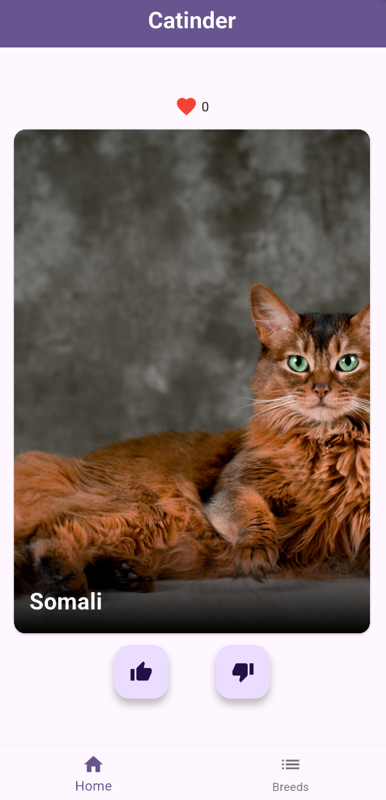
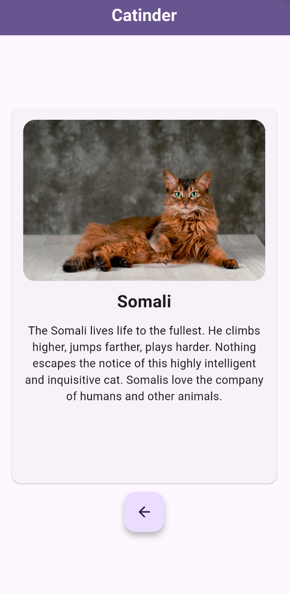
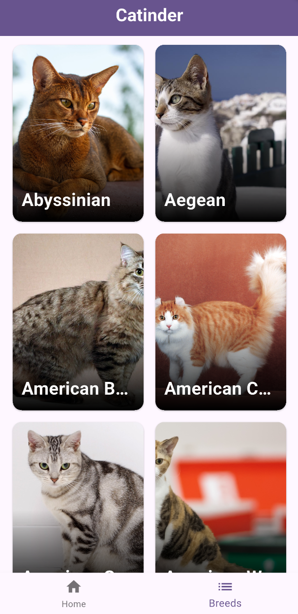
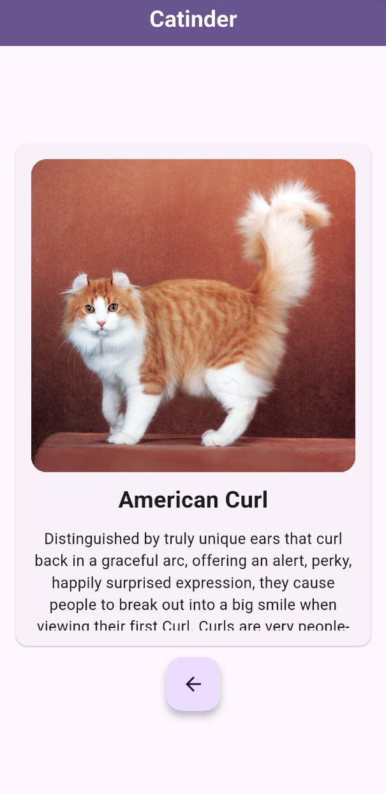
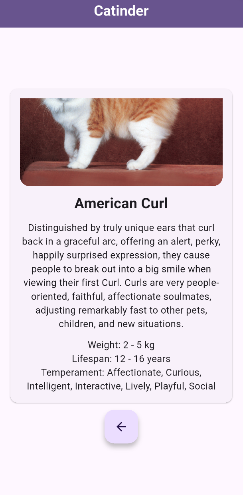

# Сatinder

Catinder — это мобильное Flutter-приложение, в котором пользователь свайпает фотографии котиков, ставит лайки и открывает для себя новые породы котов.
Источник данных — TheCatAPI.

## Функциональность

* Получение случайных изображений с TheCatAPI;

* Свайп карточек котиков влево/вправо (лайк/дизлайк);

* Счётчик лайков в реальном времени;

* Описание котика при нажатии на карточку;

* Страница со списком пород, где можно посмотреть их подробные карточки;

* Подробная карточка породы:

    * имя породы;

    * описание;

    * несколько фактов о породе (вес, продолжительность жизни, темперамент);

* Минималистичная иконка

## Скриншоты приложения

* Главный экран с карточками котиков

* Экран с описанием котика

* Страница со списком пород

* Описание породы

* Описание породы (проскроленное)

## Установка

Ссылка на актуальный apk файл: [build/app/outputs/flutter-apk/app-release.apk](build/app/outputs/flutter-apk/app-release.apk)